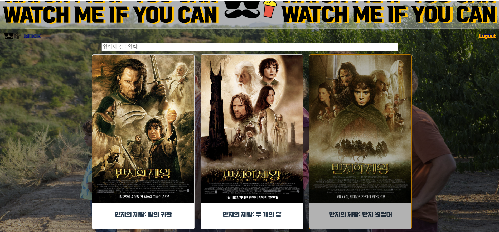

## `FINAL PROJECT`

## 6조 최보영 & 박현영

---

> #### 팀원 정보 및 업무 분담 내역

- **최보영** (팀장) : `Vue & 기능 구현`
  
  - Vue
    
    - **App.vue**
      
      : bootstrap 의 nav bar 이용하여 nav bar 구현
    
    - **HomeView.vue**
      
      : 인기 영화 정보를 담은 카드들의 목록 구현
      
      > ###### 하위 컴포넌트 : MovieCard.vue
    
    - **SearchListView.vue**
      
      : 검색창에 입력한 값을 기반으로 관련 영화 카드들의 목록 구현
      
      > ###### 검색창에 입력 후 엔터를 누르면 SearchListView.vue 로 이동
      > 
      > ###### 하위 컴포넌트 : MovieCard.vue
    
    - **MovieCard.vue**
      
      : 영화 포스터 이미지와 영화 제목으로 구성된 카드 구현
    
    - **MovieView.vue**
      
      : 영화 상세정보를 볼 수 있는 페이지 구현
      
      > ###### 영화 상세정보 (영화 제목, 평점, 개봉일자, 줄거리)
      > 
      > ###### 영화 관련 유튜브 영상 자동 재생
      > 
      > ###### 최신 영화 추천 (하위 컴포넌트 : LatestMovies.vue)
    
    - **LatestMovies.vue**
      
      : 추천 알고리즘을 통해 가져온 최신 영화의 포스터 이미지와 영화 제목으로 구성된 카드 구현
      
      > ###### 카드 클릭 시 커뮤니티 페이지로 이동
    
    - **CommunityView.vue**
      
      : 영화 관련 유튜브 영상을 시청할 수 있고, 기대평, 감상평을 남길 수 있는 커뮤니티 페이지 구현
      
      > ###### 댓글 작성, 댓글 수정, 삭제할 수 있는 목록 (하위 컴포넌트 : CommentCreate.vue, CommentList.vue)
    
    - **CommentCreate.vue**
      
      : 댓글을 작성하는 폼 구현
    
    - **CommentList.vue**
      
      : 작성된 댓글의 목록 구현
      
      > ###### 댓글 목록 (하위 컴포넌트 : CommentListItem.vue)
    
    - **CommentListItem.vue**
      
      : 작성된 각각의 댓글의 수정, 삭제 기능 구현
      
      > ###### 수정 버튼을 클릭하면 댓글을 수정할 수 있는 창 열림 (하위 컴포넌트 : PopUp.vue)
    
    - **PopUp.vue**
      
      : 댓글 수정시 필요한 폼 구현
    
    - **SignupView.vue**
      
      : 회원가입 페이지 구현
    
    - **LoginView.vue**
      
      : 로그인 페이지 구현
    
    - **NotFound404.vue**
      
      : 404 에러 페이지 구현

- **박현영** (팀원) : `Django REST Framework & CSS` 
  
  - Django REST Framework
    
    - **movies 앱**
      
      1. models.py
         
         : Top_Movie, Now_Movie, Comments model 작성
      
      2. urls.py
         
         : Top_Movie 영화목록, Now_Movie 영화목록, 댓글 목록, 댓글 상세정보, 댓글 생성 작성
      
      3. serializers.py
         
         : Top_Movie 와 Now_Movie 모델의 각각의 영화목록 직렬화, Comments 모델의 댓글직렬화 작성
      
      4. views.py
         
         : 작성한 serializer 를 이용하여 views 함수 작성
         
         작성 예시 - 영화 목록 함수
    
    - **accounts 앱**
      
      1. settings.py, models.py
         
         : User 모델 설정
      
      2. urls.py
         
         : 회원가입 url 작성
      
      3. serializers.py
         
         : User 들을 직렬화할 UserSerializer 작성
      
      4. views.py
         
         : 작성한 serializer 를 이용하여 views 함수 작성
  
  - CSS
    
    - **nav  bar CSS 지정**
    
    - **글자 스타일 설정**
    
    - **배경 이미지 설정**
    
    - **최신영화 리스트 스크롤 구현**
    
    - **댓글 목록 스타일 구현**

---

> #### 목표 서비스 구현 및 실제 구현 정도

- 목표 서비스
  
  - 평점이 높은 영화와 현재 상영중인 **영화 조회** 서비스
  
  - 평점이 높은 영화와 현재 상영중인 **영화 검색** 서비스
  
  - 영화의 **상세정보 조회** 서비스
  
  - 영화 **추천** 서비스
  
  - 영화에 **좋아요**를 누를 수 있는 서비스
  
  - 영화에 기대평, 감상평 남길 수 있는 **커뮤니티** 서비스
  
  - **팔로우** 기능 서비스
  
  - 현재 상영중인 영화는 영화관에서 관람을 원할 시, 바로 예매로 이어지도록 **예매 사이트로 이동** 가능한 서비스

- 실제 구현
  
  - **영화 전체 조회**
  
  - **영화 상세정보 조회**
  
  - 검색창을 이용한 **영화 검색**
  
  - 장르에 기반한 **영화 추천** 
  
  - 댓글 작성, 수정, 삭제 가능한 **커뮤니티**
  
  - **회원가입, 로그인**

---

> #### 데이터베이스 모델링 (ERD)

- Top_Movie, Now_Movie, Comments, Genre, User
  
  

---

> #### 영화 추천 알고리즘에 대한 기술적 설명

- Top_Movie 리스트 인 MovieCard 를 하나 클릭한다.

- 클릭한 영화가 가지고 있는 장르 중에서 하나를 랜덤으로 고른다.
  
  - 인덱스를 랜덤으로 하나 뽑아 장르를 랜덤으로 하나 가져온다.

- Now_Movie 리스트 중에서 랜덤으로 뽑은 장르를 가지고 있는 영화들을 찾는다.

- 찾은 영화들을 랜덤으로 최대 9개까지 뽑아 추천한다. 
  
  ```javascript
  recommendMovie() {
        axios({
          method: 'get',
          url: 'http://127.0.0.1:8000/movies/now/'
        })
          .then((res) => {
            const random_index = Math.floor(Math.random() * (this.genres.length))
            const genre = this.genres[random_index]
            const recommend_movies = res.data.filter((movie) => {
              return movie.genres.includes(genre)
            })
            const randommovie9 = recommend_movies.sort(() => 0.5 - Math.random())
            const recommend1 = randommovie9.splice(0, 9)
            const result = recommend1.filter((recommend) => {
              return recommend.id != this.movie.id
            })
            this.recommends = result
  
          })
          .catch((err) => {
            console.log(err)
          })
  ```

---

> #### 서비스 대표 기능에 대한 설명

- **영화 전체 조회**
  
  영화 전체를 카드 형식으로 볼 수 있는 메인 페이지입니다. 카드 위에 마우스를 올리면 테두리 색 변경과 필터가 적용됩니다.
  
  배경이미지는 랜덤으로 바뀝니다.
  
  

- **영화 상세정보 조회**, 장르에 기반한 **영화 추천**
  
  영화 제목, 평점, 개봉일자, 줄거리, 포스터, 영화 관련 유튜브 영상을 볼 수 있습니다.
  
  아래에는 해당 영화의 장르와 관련된 최신영화들을 추천하여 스크롤바를 이용하여 최신 영화 카드를 볼 수 있습니다.
  
  배경이미지는 해당 영화의 이미지입니다.
  
  
  
  

- 검색창을 이용한 **영화 검색**
  
  영화 카드 위에 있는 검색창을 통해 영화제목의 일부를 입력하고 엔터를 누르면 제목에 해당 글자가 들어있는 영화 카드들만 보여줄 수 있습니다.
  
  검색된 영화를 클릭 시 해당 영화의 상세정보 페이지로 이동합니다.
  
  배경이미지는 랜덤으로 바뀝니다.
  
  
  
  

- 댓글 작성, 수정, 삭제 가능한 **커뮤니티**
  
  각 댓글의 X 버튼을 클릭하면 댓글 삭제를 할 수 있습니다.
  
  수정 버튼을 누르면 댓글 수정할 수 있는 창이 아래에 생깁니다.
  
  완료 버튼을 누르면 댓글이 수정되고, X 버튼을 누르면 수정을 취소하고 창을 닫을 수 있습니다.
  
  영화 제목을 클릭하면 해당 영화의 상세페이지로 이동합니다.
  
  또한, 커뮤니티 페이지에서 댓글을 작성하려 할 시, 로그인한 사용자만 댓글을 작성할 수 있습니다. 로그인을 하지 않았다면 로그인 페이지로 이동합니다.
  
  배경이미지는 해당 영화의 이미지입니다.
  
  
  
  
  
  

- **회원가입, 로그인**
  
  아이디와 비밀번호를 입력하여 간단하게 회원가입을 할 수 있습니다.
  
  회원가입 후 바로 로그인 페이지로 이동하여 로그인을 할 수 있습니다.
  
  배경이미지는 랜덤으로 바뀝니다.
  
  
  
  

---

> #### 기타 (느낀 점, 후기 등)

- **최보영**
  
  `이번 최종 프로젝트는 SSAFY 에서 지금까지 배워온 모든 것을 활용해 처음부터 끝까지 하나의 프로젝트를 완성해 보았습니다. 큰 틀이 짜여져 있던 지난 관통프로젝트와는 다르게 최종 프로젝트는 프로젝트 기획 부터 CSS 까지 단계별로 해야 할 일들이 많았습니다. 프로젝트 기획 때 세웠던 목표를 전부 구현할 수는 없었지만 충분한 경험을 했다고 생각합니다. 특히 팀원과의 소통이 무엇보다 중요하다는 것을 깨달았습니다. 다음 학기의 프로젝트에서도 소통을 자주 하며 목표를 완수할 수 있도록 노력하겠습니다.`
  
  `저의 첫 프로젝트인만큼 어려운 점도 많았지만 팀원과의 협동, 교수님의 도움, 구글링을 통해서 하나씩 해결할 수 있었습니다. 분명 혼자서 했다면 시간이 지금보다 몇 배 더 걸렸겠죠. 중간에 많이 지치기도 할테구요. 하지만 역할 분담과 팀원의 끊임없는 지지 덕분에 이 프로젝트를 무사히 마무리 할 수 있었습니다. 첫 시작은 미약하게 출발하였지만 계속 발전하여 성장하도록 하겠습니다. 감사합니다.`

- **박현영**
  
  `1학기동안 학습한 내용들을 활용해 프로젝트를 진행하는 동안 부족한 점과 보완해야 할 점들을 되돌아보는 활동이였습니다. 특히 vue 부분에서 많이 부족한 것 같아서 개인공부를 더 해야겠다고 느꼈습니다. 기능이 추가 될 수록 코드가 복잡했고 관리하기 힘들어서 유지 보수하기 쉬운 코드를 작성하는 것이 얼마나 중요한지 느낄 수 있었습니다.`
